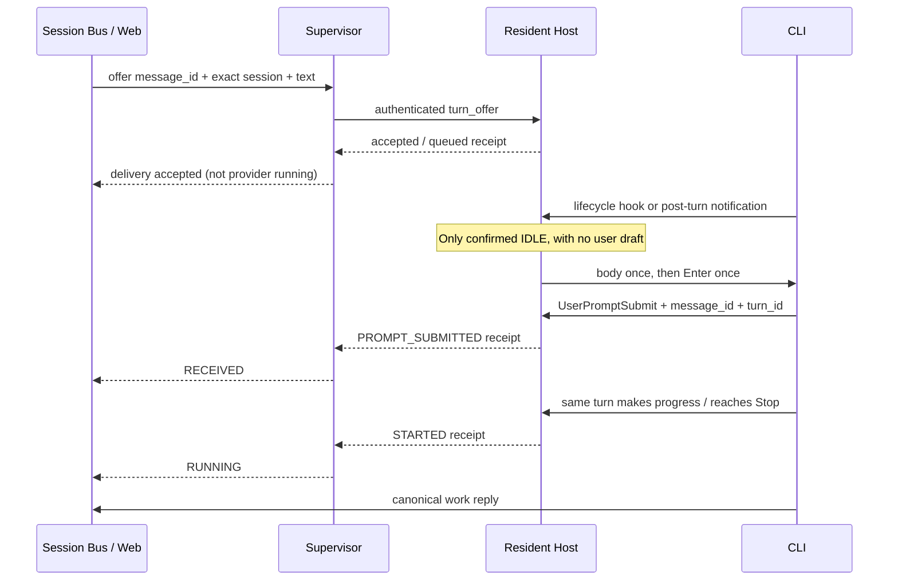

# Host-owned CLI turn delivery

Updated 2026-09-14. User decision: Supervisor hands work to the surviving Host; vendor CLI hooks report lifecycle only to that Host. The Host owns terminal delivery and publishes its receipts back through Supervisor to Session Bus.

## Evidence and limits

The reported symptom was a dispatched message left in the composer until the user pressed Enter. The original incident's exact cause is **UNKNOWN**: dispatch attempts do not prove physical writes, and a late visible composer can be an older unsubmitted message.

The confirmed ownership problem in the pre-change source was independent of that hypothesis: `TerminalHost.submit_prompt` in the Python Supervisor owned text/Enter and accepted output-based verification, while the Stop hook independently read the Bus and constructed model continuation. A stalled dispatch could release its claim for another delivery attempt. Neither PTY output nor Stop proves that the CLI is idle.

## Vendor research

| Vendor / installed version | Start or receipt | End / waiting evidence | Implementation |
| --- | --- | --- | --- |
| Codex 0.153.4 | UserPromptSubmit, with turn_id | Stop is pre-completion; notify agent-turn-complete is the post-turn signal | Managed Rust launches install session-specific notify; project hooks report receipt, Stop, permission, interrupt and session end |
| Claude Code 2.1.270 | UserPromptSubmit | Stop can request continuation; Notification idle_prompt follows about 60 seconds without input | State-only hooks; existing Host-owned Claude channel remains the transport |
| Grok 1.0.30 (04b7ffed98c6) | UserPromptSubmit, promptId | Stop can repeat; idle_prompt follows roughly a minute of inactivity; StopFailure/StopCancelled cover abnormal endings | State-only hooks with camelCase aliases and promptId correlation |
| Gemini CLI, not installed | BeforeAgent | AfterAgent can be denied and trigger another attempt; it is not proven idle | Normalization covered, but no launcher or automatic delivery capability claimed |

Sources inspected: [Codex hooks](https://learn.chatgpt.com/docs/hooks), [Codex notify](https://learn.chatgpt.com/docs/config-file/config-advanced), [Claude hooks](https://code.claude.com/docs/en/hooks), [Grok official hooks source](https://github.com/xai-org/grok-build/blob/main/crates/codegen/xai-grok-pager/docs/user-guide/10-hooks.md), and [Gemini hooks](https://geminicli.com/docs/hooks/reference/). Grok was also checked against the installed `.grok/docs/user-guide/10-hooks.md`. These are documented contracts, not claims that every vendor was exercised live with an LLM.

Codex project config ignores notify; the managed launch supplies it via `-c`. This changes notify for that managed process and does not edit the user's global config. Background `agent_completed` / `task_complete` notifications are not treated as the foreground CLI becoming idle.

## Ownership and state transitions

* Rust `turn_delivery` is the sole input owner for the new CODEX/GROK Bus path. Supervisor forwards and reads; it does not paste or press Enter there.
* The Host reserves STARTING before writing. The same message_id and identical payload return the existing receipt, including after Supervisor replacement. A changed payload conflicts. The Host never retries an uncertain body or Enter write.
* The hook sends only provider/session identity, event, timestamp, turn ID and the parsed instruction message ID. It never fetches Bus messages and always returns empty model context. Subagent events and mismatched sessions are excluded.
* Stop means STOPPING. UserPromptSubmit proves receipt, not successful model execution. A later event must match the delivery's turn ID before publishing STARTED. Old turn endings cannot overwrite a newer turn.
* User terminal input blocks automatic delivery; cursor reports and focus notifications do not count as a draft. Submission clears the draft flag. Erasing an entire draft without submitting has no reliable vendor hook and conservatively remains blocked.
* Hook arrival can drain a queued message without waiting for a Web polling cycle. The existing five-second Bus reconciliation only projects receipts and never sends input.
* A canonical reply still owns task completion. A delivery receipt does not complete a project TODO or a Master queue item.

## Failure and migration contract

The capability is `HOST_TURN_DELIVERY_V1`. Missing capability never falls back to guessed PTY delivery. UNKNOWN, active input, permission waits, STARTING and WRITE_UNCERTAIN do not become idle by timeout. A CLI that never emits a usable idle signal therefore cannot be automatically awakened by this path. Stop-only providers need a separately verified post-turn adapter.

At-most-once delivery is scoped to the lifetime of the resident Host. Supervisor restarts preserve the in-memory ledger. The Host retains at most 1024 receipts and refuses new entries when full; it does not evict IDs and accidentally replay them. Private discovery snapshots contain only the latest 64 receipts and omit prompt text. Host process death is not a successful delivery and must not be silently reassigned to a different session.

Windows locks a running executable. The new binary is built as `universe-session-host-v2.exe` beside the old executable. The launcher prefers v2; existing live Hosts retain their old code until their sessions are reopened/resumed. A Supervisor or Web restart alone does not upgrade a resident Host. The old executable fallback and `universe_session_bus_hook.py` command alias are migration compatibility only; remove them after old Host sessions and installed hook configurations have been retired. The alias reports lifecycle only and cannot generate Stop continuation.

## Verification record

* Rust state-machine tests cover Stop versus idle, receipt versus running, old-turn events, duplicate and conflicting payloads, user drafts, and uncertain body/Enter writes.
* The actual Rust Host fixture writes to a real ConPTY, replaces its Supervisor attachment, reoffers the same message, and observes exactly one body and one Enter attempt. No live provider message or production task is created by this fixture.
* HTTP forwarding, Bus receipt projection, hook installation preservation/idempotence, exact provider binding and existing terminal launch regressions are covered by Python tests.
* Test result artifacts and deployment observations are retained under `.ai/runtime/tmp/host-turn-delivery-20260914/`. Vendor runtime hooks beyond these fixtures require observation in newly opened managed sessions; old resident sessions cannot establish that evidence.

### Applied results

Rust: 11 tests passed. Python: the main 120-test group passed, followed by 22 tests for the shared Host error change and 24 packaging/Supervisor tests; these groups overlap. Release v2 build and `git diff --check` passed.

Supervisor restarted from PID 18468 to 60652; Web service.restart operation `host-turn-web-20260914` reached COMPLETED with PID 21600. Existing Codex and Claude resident Hosts (40220 and 14076) retained their process start identities, terminals and Session Anchors. Their live API projection has no HOST_TURN_DELIVERY_V1 capability, as expected for old binaries. New managed Host launch/resume is still required for live vendor-hook validation.

Portable builds read the new v2 Cargo output and copy it to the existing packaged `runtime/session-host/universe-session-host.exe` path. Source launch discovery prefers the side-by-side v2 binary; old running executables are not overwritten.

## Follow-up: Host exit must retain Resume visibility

The user reported that terminating a Host removed its entry from the resume menu. Source tracing confirmed that `renderTerminalNewMenu` rendered only the `reattach` array, ignoring the API's `resume` array. The server also built open-anchor exclusions from all terminal records, including CLOSED/EXITED records. Live API inspection additionally showed canonical Current Anchor rows whose provider was UNKNOWN and whose Anchor differed from their live Supervisor session.

The menu now renders recorded Resume entries separately and invokes the existing `session.resume` path with the original session. Only LIVE terminals suppress resume candidates; exact Supervisor session IDs also suppress duplicates when canonical and runtime Anchors differ. For an exact session/project/mode match, provider and runtime Anchor come from the durable Supervisor session record, which survives Host termination. No stale shell file is promoted to provider authority.

Real browser clicking exposed a second UI issue: the menu was intercepted by the enclosing Conductor panel. The existing menu now uses a positioned browser popover, escaping ancestor clipping and retaining normal click handlers. Regression validation: six Python tests passed, a JS menu test passed, and a Chromium browser test clicked a closed-session fixture through the actual menu while stubbing only the provider-launch boundary. Screenshot: `.artifacts/ui/resume-closed-host-20260914.png`. Browser test context bypassed CSP for test instrumentation; production CSP was unchanged.

Web restart `resume-list-web-20260914` completed (PID 61320). Live API shows four recorded resume candidates and excludes the two currently LIVE sessions by their exact IDs. Those two production Hosts were preserved. Actual production Host termination and vendor CLI resume were not performed during this verification.

### Resume list exclusion

Each Resume row now has `목록 제외`. This is a browser preference stored under `universe.resume.excluded.v1`, keyed by project and durable session ID. It does not terminate a Host, delete a session, or modify the server catalog. `제외 항목 보기` reveals disabled excluded rows with `복원`; the default view hides them again after reload. Preference write failure is reported and does not pretend the exclusion was saved.

The existing JS regression verifies persistence, restore and unchanged session data. A real Chromium session using the live catalog verified exclude, page reload, hidden state, show-excluded, restore and menu bounds, with no page errors. Test preferences were restored in the isolated browser context. Screenshot: `.artifacts/ui/resume-list-exclusion-20260914.png`. Static UI assets are served directly; no service restart is required.

## 2026-09-14 TUI submit regression comparison

The failed self probe `msg_337036bad333bda5` recorded body_writes=1 and
submit_writes=1 without a write error. The matching PROMPT_SUBMITTED arrived
about 54.1 seconds after the Enter attempt, when the user reported manual
submission. This is not evidence of successful automatic submission.

Confirmed source difference: Python `TerminalHost._wait_tui_composer_ready`
waited for post-body output and a quiet interval (or additional settling after
Codex's paste placeholder). Rust `TurnDelivery::drain` replaced this with an
unconditional 500ms delay. Python also bounded submission verification at
30 seconds; the new Rust route had no acknowledgement deadline.

The Host now records baseline/output cursors, first and last output timing,
quiet time and total elapsed time. It requires output advancement followed
by 500ms quiet, within a 2-second observation budget. This conservatively
restores output-based pacing without provider-screen parsing. Timeout yields
INPUT_UNCONFIRMED and no Enter; the body is never repeated. Output settling is
transport evidence only, not composer readiness or turn acceptance. Unrelated
repaints can satisfy this heuristic; the matching lifecycle hook remains the
acceptance evidence. No claim is made that the original failure's exact CLI
input handling has been proved.

On subsequent Host IPC observation, an unmatched Enter attempt older than
30 seconds becomes SUBMIT_UNCONFIRMED / HOST_SUBMIT_ACK_TIMEOUT. This records
uncertainty and prevents retries; it does not complete a Bus message or TODO.
A late matching prompt hook can still correlate the turn, preserving the earlier
timeout evidence. Deadline projection depends on Host requests (the normal
status polling path), not a new input-producing timer.

Validation: 14 Rust tests passed, including delayed output beyond the old
500ms boundary, no-output/continuous-output timeout, no duplicate writes, and
late matching acknowledgement. The isolated real ConPTY supervisor-rebind
fixture passed against the rebuilt debug Host. This fixture runs cmd.exe,
not a live Codex turn. Existing resident release Hosts retain their old code;
live Codex automatic submission remains unverified until a rebuilt Host is
launched and its actual lifecycle evidence is observed. No additional self-test
messages or input retries were generated in this investigation.

## Terminal injection slot UI

Each mounted terminal has a read-only automatic injection slot above its xterm
viewport. It shows one message, not a mailbox/history editor. It reads the
existing authenticated Session Bus ACTIVITY projection for that exact Session
Anchor and correlates the Host's latest delivery by message_id. Existing terminal
catalog refresh/tab selection drives updates; no new polling timer or dispatch
owner is introduced. The browser never sends a second body or Enter from this
slot. Rendering a slot does not claim a direct CLI submit API exists.

Unacknowledged/failed text remains visible; acknowledged text is cleared.
Host write attempts alone cannot clear it or mark execution started. Host hook
receipt, execution phase and terminal message outcome are kept distinct. Older
Hosts with a submit attempt older than 30 seconds show submission confirmation
delayed locally, without mutating the Bus. Query errors remain visible and do not
silently clear text. Pending content uses textarea.value, never HTML rendering;
the slot does not share xterm's focus or mouse-wheel input handlers.

This change exposes the existing Host delivery path. It does not bypass the TUI
parser or prove recovery of the unresolved automatic Enter incident. A provider
submit interface or modified provider input handler requires separate capability
verification before claiming that boundary has been removed.

## Codex native queue (2026-09-14)

Installed Codex 0.153.4 exposes `codex queue --thread UUID --message TEXT`.
The exact-version official implementation calls `thread/queue/add`, preserving
one queued submission independently of TUI keystrokes. The self probe
`native-queue-self-probe-20260914` was accepted as queued submission
`01a09fb1-d574-7643-beaa-00d78db9e190` on existing thread
`01a09ad0-7edc-75d0-8357-2dca0f074e8a`. It became a real subsequent user turn;
the same Host recorded PROMPT_SUBMITTED for turn
`01a09fb2-1d3e-7a32-9301-a8a50974022d`. PTY body and Enter writes were both zero.
Evidence is under `.ai/runtime/tmp/host-turn-delivery-20260914/`, files
`native-queue-self-probe-20260914.json` and
`native-queue-self-probe-received-20260914.json`. No Bus reply was generated.

Host v3 uses native queue only for Codex. Supervisor supplies the resolved
native executable at Host launch; incoming messages cannot choose executable
or transport. Host validates the existing provider/session binding, reserves
each message before execution, records queue_calls and queued_submission_id,
and never falls back to PTY. Command execution uses exact arguments without a
shell, a bounded wait, and an exact-thread receipt check. Timeout/nonzero/invalid
receipt remains NATIVE_UNCONFIRMED and never triggers an automatic replay.
The in-memory dedup ledger survives Supervisor replacement while this Host
stays alive; no cross-Host exactly-once guarantee is claimed after Host loss.

Queue reservation is persisted before the helper runs, outside the Host state
lock and after the HTTP/IPC response. Queue acceptance is NATIVE_QUEUED, not
PROMPT_SUBMITTED or STARTED. Matching lifecycle hooks preserve early acceptance
when the helper's receipt arrives later. The injection slot retains queued text
until actual prompt acknowledgement. Grok retains its separate PTY transport;
Claude retains its native channel. Neither is claimed to be fixed by Codex queue.

A side-by-side `universe-session-host-v3.exe` is selected for new Hosts. Running
v2 Hosts remain alive. Updated Supervisor rejects Codex delivery to an old Host
with HOST_NATIVE_QUEUE_UPGRADE_REQUIRED instead of secretly using PTY. Existing
Codex terminals need one Host replacement/resume to use this adapter.

Official source references (tag rust-v0.153.4):
- https://github.com/openai/codex/blob/rust-v0.153.4/codex-rs/cli/src/queue_cmd.rs
- https://github.com/openai/codex/blob/rust-v0.153.4/codex-rs/tui/src/session_queue_commands.rs
- https://github.com/openai/codex/blob/rust-v0.153.4/codex-rs/app-server/src/request_processors/thread_queue_processor.rs
