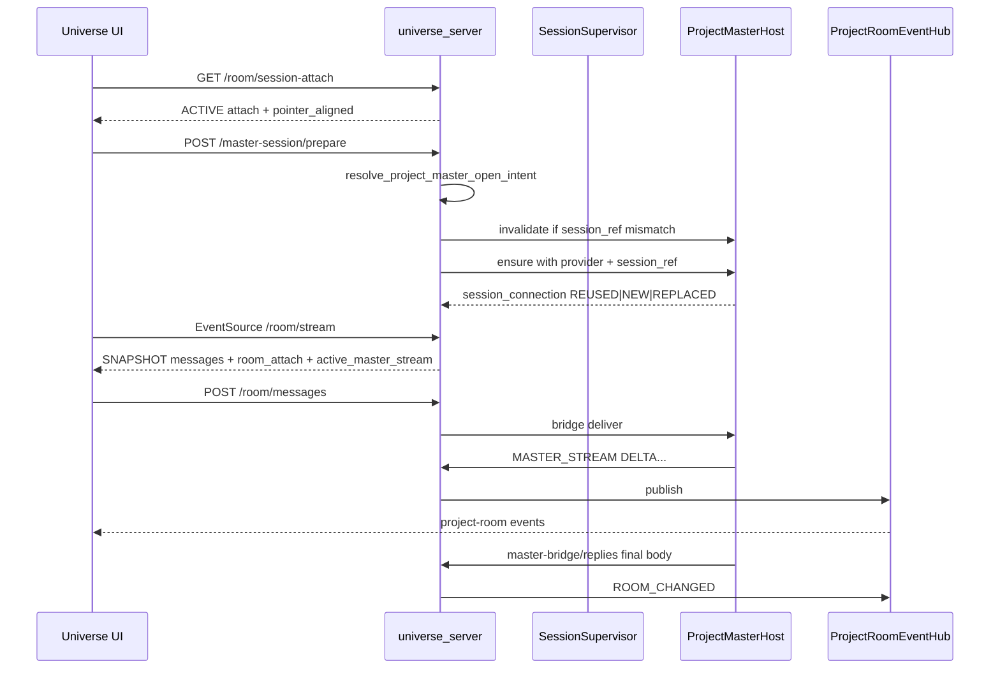
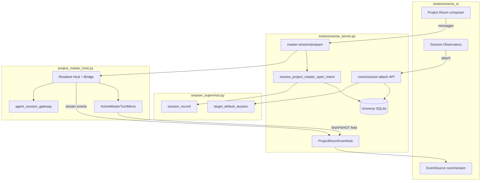
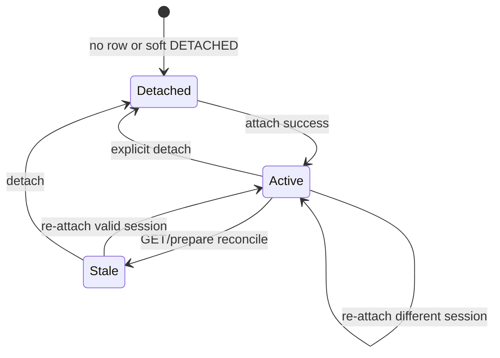

# Project Room Session Attach + Chat Streaming Mirror

| Field | Value |
|-------|--------|
| **Document title** | Project Room Session Attach + Chat Streaming Mirror |
| **Author** | _TBD_ |
| **Date** | 2026-08-05 |
| **Status** | Draft (revision 3 — residual algorithm holes closed; aligned to multi-room product 2026-08-05) |
| **Repository** | `C:\workspace\universe` |
| **Parent product architecture** | `docs/multi-room-chat-architecture.md` |
| **Related docs** | `docs/local-session-supervisor.md`, `docs/local-universe-service.md`, `docs/universe-ui-design.md`, `docs/provider-session-validation-todo.md` |
| **Program slice** | **S1** of multi-room architecture (Project room Master attach + stream). Boss-room / Meeting-room attach are later slices. |

---

## Overview

This document is the **implementation design for Project-room Master session attach and streaming mirror** — one slice of the larger multi-room product (`docs/multi-room-chat-architecture.md`).

Product context (do not implement the full multi-room map in this slice alone):

- **Project room**: user ↔ Master; user instructions land here.
- **Boss room** (later): Boss is host; Master attaches to coordinate; user observe-only; dialogue is decision evidence; Boss distills Bench/files.
- **Meeting room** (later): Conductor hosts multi-model debate via Skill; user may interrupt.
- **Session inject**: Observatory is not the only entry; harness boot may push `provider_session_ref` (S2).
- **Continuity**: session-ref resume restores *meaning*; durable room turns + post-resume bridge line restore *timeline feel*; `RESUME_SAVE` is compressed context only.

Operators already see Supervisor-registered persistent Mode sessions in Session Observatory and can “Use session” / “Reconnect,” which sets the `(node, mode)` default pointer and, for `mode=MASTER` when `node` matches an attached project, calls `callProjectMaster` to prepare the resident Project Master Host and open the Project Room SSE stream. Provider partial text already flows as transient `MASTER_STREAM` events through `ProjectRoomEventHub`; only the completed Master reply is durable room history.

What this slice adds is an **explicit, durable Project Room ↔ Supervisor session attach binding** with clear reconnect semantics, a **productized streaming mirror** (including mid-turn rehydrate), and a **minimal continuity bridge** so reconnect does not feel like a blank chat even when meaning was restored via ref.

**S1 must deliver all of:** (1) durable attach row + APIs, (2) prepare/send that honor attach including **resident Host invalidate on session_ref mismatch**, (3) thin UI attach/reconnect (function-first, not final chrome), (4) process-local mid-turn stream rehydrate via SNAPSHOT `active_master_stream`, (5) post-resume / post-attach **bridge line** in room chrome from attach metadata + optional last durable turns. Shipping attach chrome without (2) or (4) is not a complete S1.

---

## Background & Motivation

### Current architecture (verified)

```text
Tray / Web UI
    |
    v
Universe local HTTP (tools/universe_server.py)
    +-- Session Supervisor (tools/session_supervisor.py)
    |     tables: session_record, session_binding_history, process_lease,
    |             target_default_session, supervisor_event
    +-- Project Room SQLite (project_room_message, project_master_bridge, …)
    +-- ProjectRoomEventHub  →  GET /v1/projects/<id>/room/stream (SSE)
    +-- Resident Project Master Host (tools/project_master_host.py)
    |     +-- last_provider / last_session_ref (host_metadata + Supervisor default)
    |     +-- ACP gateway (tools/agent_session_gateway.py)
    |     +-- stream via post_master_stream_event → /master-bridge/stream
    +-- Continuity coordinator (project-local; not room history)
```

**Session Supervisor** (`docs/local-session-supervisor.md`, `tools/session_supervisor.py`):

- Provider-neutral identity: `(node, mode, session_id)`.
- Stores `provider`, `provider_session_ref`, lifecycle state (`LIVE` / `DISCONNECTED` / …), process lease, alias, bounded summary.
- Does **not** store full vendor transcripts.
- Observability: `GET /v1/runtime/audit` → `sessions[]`; UI Session Observatory in `tools/universe_ui/app.js`.
- Default pointer: `POST /v1/supervisor/sessions/{session_id}/default` (UI may set without service control token).
- `UniverseStore` and `SessionSupervisorStore` share the same SQLite path (`store.database_path`).

**Project Room + streaming** (`docs/local-universe-service.md`):

- Durable history: `project_room_message` in Universe SQLite.
- Resident Host + Bridge for conversation; `Call Project Master` → `POST /v1/projects/<id>/master-session/prepare`.
- Product contract today: **merely selecting a Project graph does not start its Host**.
- SSE: `GET /v1/projects/<project_id>/room/stream` via `ProjectRoomEventHub`.
- Stream payload types used today: `SNAPSHOT`, `ROOM_CHANGED`, `MASTER_STREAM` (`STARTED` / `DELTA` / `COMPLETED` / `FAILED`), `AGENT_PERMISSION`.
- Partial Master reply is **transient** SSE; completed reply is durable (`PROJECT_MASTER` message, `MASTER_REPLY_RECORDED`).
- UI: `openProjectRoomStream` already appends `DELTA` into `state.projectStreamReplies[in_reply_to]`.

**SSE connect behavior today (code-accurate):**

- `_stream_project_room` sets `cursor = project_room_events.cursor()` (global high-water) at connect time.
- Emits SNAPSHOT of durable messages/permissions/proposals only — **does not** replay retained hub events.
- Then waits for events with `event_id > cursor` only (future events).
- No `Last-Event-ID` handling on this path.
- Hub retains last N events per project (`retained_events` default 512) for callers that already know an earlier id; **the UI EventSource path never supplies that id**, so mid-turn reconnect **always loses prior DELTAs** for the in-flight turn until the next live `DELTA` or final `ROOM_CHANGED`.

**Coordinate reuse already present** (`ProjectSessionStore.last_provider_session` in `project_master_host.py`):

1. Prefer Supervisor **default** session for `(node=project_id, mode=MASTER)` with non-empty `provider_session_ref`.
2. Else legacy `host_metadata` keys `last_provider` / `last_session_ref`.
3. `observe_provider_session` registers/updates Supervisor and host_metadata **after successful open**.

**Resident Host reuse gap today (blocking for attach):**

1. `UniverseServer.prepare_project_master_session` only calls `ensure_project_master` and returns `session_connection` — it does not re-resolve a target session coordinate from attach.
2. `ensure_project_master` short-circuits to `EXISTING_BRIDGE` when a managed bridge is `REGISTERED`/`AVAILABLE` and the resident Host is live — **no attach/session_ref comparison**.
3. `ProjectMasterHosts.ensure` reuses a live handle when `handle.provider == selected_provider` only; it does **not** compare `provider_session_ref`. Same-provider attach to a different Supervisor session will falsely report `REUSED` on the old session.
4. `ResidentModeSessionHost._ensure` *does* compare session_ref, but that is not the path multi-project resident Masters use when the whole handle is reused by provider name.

**CLI provider setting:** `ProjectMasterHosts.ensure` selects the process provider via `provider_resolver` / configured `cli_provider_setting` (`AUTO`/`GROK`/`CODEX`/`CLAUDE`). Attach can disagree with that setting; v1 must fail closed (see Coordinate resolution).

**Observatory “Use session” today** (`app.js` ~394–421):

1. Optionally set default.
2. If `session.node` matches a project and `session.mode === "MASTER"` → `callProjectMaster(projectId)`.
3. Else → Conductor dock.
4. No durable “room attach” record; no session_ref-aware Host switch.

**Auth model today (code-accurate, not the optimistic doc claim):**

- Loopback clients: `_authorize` allows requests **without** Bearer for ordinary `/v1` project routes.
- Non-loopback / service-control paths require Bearer / control token as implemented.
- `docs/local-universe-service.md` text that every `/v1` route requires Bearer already drifts from implementation.
- EventSource room stream is cookie-less GET without `Authorization`.

### Pain points

| Pain | Detail |
|------|--------|
| Implicit attach | Continuity depends on default pointer + prepare side effects; room UI does not show “attached session X / LIVE / provider_ref”. |
| Silent Host reuse | Even after default change, resident Host may stay on old same-provider session_ref. |
| Reconnect friction | Reopening the room may show history without guaranteeing host resume of the intended Supervisor session. |
| Mid-turn SSE blank | EventSource reconnect loses prior DELTAs; no SNAPSHOT rehydrate of in-flight assistant text. |
| Streaming perception | Non-stream path and “Thinking” labels feel opaque when no DELTAs arrive. |
| Wrong mental model | Full vendor UI mirror or desktop transcript import are out of scope and unsafe. |

---

## Goals & Non-Goals

### Goals (S1 / this document)

1. **Attach**: From Session Observatory **and** session-ref inject (S2 may land inject API first or in parallel), bind a Supervisor `session_id` to a **Project Room** so subsequent room messages continue that provider session via the resident Project Master Host.
2. **Streaming**: Provider partial/final **assistant text** streams into room SSE (`MASTER_STREAM` / `ProjectRoomEventHub`). Durable history remains final turns only. Mid-turn SSE reconnect rehydrates in-flight assistant text via SNAPSHOT `active_master_stream` (process-local; **must-have**). Explicit UI labels for transient vs durable.
3. **Reconnect + timeline feel**: When conversation target becomes `PROJECT_MASTER` (dock open) or attach runs with `prepare: true`, prepare/resume the bound session and open SSE without a second manual “Use session,” when coordinates are still viable. Show recent durable room turns + a short **bridge line** (attached session label, provider, “resumed / new”, optional one-line summary). Rail/graph select alone does **not** prepare.
4. **Trust honesty**: Attach never creates Current Anchor, authority, Execution Assignment, or write scope. Room messages remain non-authoritative chat transport. API/UI enforce negative field and copy lists.
5. **Function-first UI**: Thin list/chip/log/input only; major multi-room UI redesign is program S7 in `multi-room-chat-architecture.md`.
6. **Incremental delivery**: Prefer small PRs against `universe_server.py`, `session_supervisor.py`, `project_master_host.py`, `universe_ui`. Feature flag defaults true only after Host reuse + stream rehydrate land.

### Non-goals (S1)

- Importing arbitrary external Grok/Claude desktop transcripts not registered in Supervisor (full dump). Seed/inject of **refs** is in-scope for program S2, not full transcript import.
- Full bidirectional vendor UI mirror (tool cards beyond existing permission bridge, native file trees, vendor settings).
- Task Frame Boss/Worker transcript persistence as durable room history (`EPHEMERAL` remains until Boss-room slice S4).
- Boss-room host=Boss / Master multi-room attach / Meeting rooms (S3–S5 in parent architecture).
- Exposing hidden reasoning / chain-of-thought / thinking blocks.
- Making attach a substitute for Execution Guard, Task Proposal approval, or Inbox dispatch.
- Rendezvous / remote pairing changes (already dogfood-complete for personal use).
- Auto-starting Project Master Host on Project rail/graph select alone (preserves existing product contract).
- Treating `RESUME_SAVE` compressed context as full chat restore (bridge may *display* optional summary; it does not replace durable room history).

---

## Proposed Design

### Conceptual model

```text
Supervisor session_record
  (session_id, node=project_id, mode=MASTER, provider, provider_session_ref, state)
        │
        │  room_session_attach (new, Universe SQLite)  ← durable product truth
        │  one ACTIVE attach per project_id (v1)
        │  always aligns Supervisor default (v1)
        v
Project Room  ──send──►  resident Project Master Host
        ▲                      │  (invalidate if provider/session_ref mismatch)
        │   MASTER_STREAM      │ session/prompt + agent_message_chunk
        │   ROOM_CHANGED       │ (ACP gateway / Claude resident stream-json)
        │   SNAPSHOT.active_master_stream
        └────── SSE ◄──────────┘
```

**Attach** means: for this `project_id`, the room’s **send path and resume coordinate** are bound to a specific Supervisor session. It is **not** authority and **not** process ownership.

- Durable product truth: the `project_room_session_attach` row (`ACTIVE`).
- v1 also **always** sets the Supervisor default for `(node=project_id, mode=MASTER)` to that session (no optional `set_default` flag) so Observatory/default consumers stay aligned — but prepare/send **must not** depend only on default; they resolve via the normative algorithm below.

### Coordinate resolution algorithm (normative)

Single server-owned function used by prepare, send, and attach-with-prepare. Pseudocode name: `resolve_project_master_open_intent(project_id) -> OpenIntent`.

```text
resolve_project_master_open_intent(project_id):
  attach = load project_room_session_attach where project_id
  cli_provider = resolve configured PROJECT_MASTER provider for project
                 (AUTO → first available; explicit GROK|CODEX|CLAUDE)

  if attach is ACTIVE:
    session = supervisor.get_session(attach.supervisor_session_id) or None
    if session is None
       or session.node != project_id
       or session.mode != "MASTER":
         mark_attach_stale(attach, reason=SESSION_MISSING|NODE_MODE_MISMATCH)
         raise ROOM_ATTACH_STALE

    desired_provider = session.provider   # live Supervisor material, not stale snapshot only
    desired_session_ref = session.provider_session_ref  # may be null
    # Refresh attach.provider / attach.provider_session_ref snapshots from session when present

    # MUST ignore conflicting Supervisor default for open intent
    # (default is aligned on attach write, but may drift later)

    if desired_provider != cli_provider:
      # Fail closed — do not auto-switch cli_provider_setting; do not silently force
      raise ROOM_ATTACH_PROVIDER_SETTING_MISMATCH
        detail: attach.provider vs configured provider

    return OpenIntent(
      source="ATTACH",
      supervisor_session_id=attach.supervisor_session_id,
      provider=desired_provider,
      session_ref=desired_session_ref,  # may be null
      pointer_aligned=(default.session_id == attach.supervisor_session_id),
    )

  # No ACTIVE attach
  default = supervisor default for (project_id, MASTER) if any
  if default and default.provider_session_ref:
    if default.provider != cli_provider:
      # Existing path: configured provider wins process selection;
      # session_ref only applies when providers match (document as today + tests)
      return OpenIntent(source="DEFAULT", provider=cli_provider,
                        session_ref=default.provider_session_ref
                          if default.provider == cli_provider else None, ...)
    return OpenIntent(source="DEFAULT", provider=default.provider,
                      session_ref=default.provider_session_ref, ...)

  legacy = host_metadata last_provider / last_session_ref
  if legacy and legacy.provider == cli_provider:
    return OpenIntent(source="LEGACY", ...)
  return OpenIntent(source="NEW", provider=cli_provider, session_ref=None)
```

**After successful provider open (ACTIVE attach path) — cold-start / observe rebind (normative):**

Today `ProjectSessionStore._supervisor_session_id` is  
`session_` + sha256(node, mode, provider, provider_session_ref)[:24], and  
`observe_provider_session` registers/updates **that** hash id and may set_default to it.  
A naive “refresh attach.provider_session_ref only” after NEW therefore **orphans** attach.supervisor_session_id (S1) while default/live Host sit on S_hash(R_new).

v1 rule after open under ACTIVE attach:

```text
1. Do NOT pre-write last_session_ref / host_metadata before open succeeds.
2. Observe open result: provider P, session_ref R_obs (required non-empty after success).
3. observed_session_id = Supervisor identity for (project_id, MASTER, P, R_obs)
   (same hash scheme as observe_provider_session / _supervisor_session_id, or the
   session_id actually returned by register_session).
4. Call observe_provider_session(P, R_obs) so Supervisor + host_metadata are LIVE.
5. If observed_session_id != attach.supervisor_session_id:
     # ATTACH_REBOUND — product identity follows the session that actually opened
     UPDATE project_room_session_attach SET
       supervisor_session_id = observed_session_id,
       provider = P,
       provider_session_ref = R_obs,
       row_version = row_version + 1,
       updated_at = now
     set_default(observed_session_id)  # same dual-store CAS helper as attach POST
     record evidence event ATTACH_REBOUND
       { project_id, prior_session_id, new_session_id, provider, provider_session_ref }
     # Do NOT leave ACTIVE attach on S1 while default/Host are on S2
6. Else (same session_id):
     refresh attach.provider / provider_session_ref snapshots from live material;
     ensure pointer_aligned (set_default if drifted)
7. last_prepare_status = connection_state (NEW|REUSED|REPLACED|…)
```

Allow cold-start NEW when attach ref was null and the provider can open without a resume ref. After success, **always** apply the rebind rule so attach, default, and Host share one Supervisor session_id. UI should show rebound if prior_session_id ≠ new (toast optional).

If open cannot produce a usable R_obs, fail `ROOM_ATTACH_PROVIDER_REF_MISSING` / prepare FAILED — do not half-update attach.

**Send path without prior prepare:** same resolution inside `ensure_project_master` / prepare helper before bridge delivery. If ACTIVE attach and prepare fails (STALE / MISMATCH / REF_MISSING), fail delivery visibly (`DELIVERY_FAILED` + reason) — do not open a different session silently.

**Attach without resumable ref (`provider_session_ref` null) + DISCONNECTED:**

- Attach POST itself succeeds (binding is recorded).
- Prepare/send: Resident reuse contract **must not** silently REUSE a prior live Host (see below). After invalidate, ensure may cold-start NEW or fail REF_MISSING.
- On NEW success: apply ATTACH_REBOUND / refresh rules above.

### Resident reuse contract (normative)

Prepare and send **must** implement. Live coordinate sources (read in this order, normalize for compare):

1. Handle-tracked `provider_session_ref` / provider.session_ref (primary).
2. Connection status / store last_ref for the project.
3. Bridge `master_session_ref` only if it is known to equal the provider resume ref for that Host implementation (otherwise treat as **unknown**, not equal).

Normalize refs before equality (strip known provider prefixes only when both sides use the same canonical form the Host stores after observe; if incomparable → treat live ref as **unknown**).

```text
1. intent = resolve_project_master_open_intent(project_id)
   # intent includes supervisor_session_id when source=ATTACH
2. If resident handle exists for project_id:
     live_provider = handle.provider
     live_session_ref = canonical provider resume ref or UNKNOWN
     live_supervisor_session_id = handle/store binding if known else UNKNOWN

     if live_provider != intent.provider:
       invalidate(project_id)

     else if intent.session_ref is null:
       # Fail-closed: do NOT reuse a prior live session for null-ref attach intent
       # (even same provider). Exception only if live is proven bound to the same
       # attach supervisor_session_id AND live_session_ref is UNKNOWN-or-null
       # because observe has not run yet on a handle just created for this attach —
       # v1 simplifies: if live_supervisor_session_id is known and equals
       # intent.supervisor_session_id and live_session_ref is null/UNKNOWN, allow
       # REUSE only when handle was opened in this prepare attempt; otherwise:
       if live_supervisor_session_id != intent.supervisor_session_id
          or live_supervisor_session_id is UNKNOWN
          or live_session_ref is not null:   # host still on a prior concrete session
         invalidate(project_id)
       # After invalidate, ensure may NEW or fail REF_MISSING — never silent stay on A

     else if live_session_ref is null or live_session_ref is UNKNOWN:
       # intent has concrete ref; live unknown → cannot prove same session
       invalidate(project_id)

     else if live_session_ref != intent.session_ref:
       invalidate(project_id)

     # optional extra: if both refs known equal but live_supervisor_session_id
     # known and != intent.supervisor_session_id → invalidate (identity drift)

3. Before returning EXISTING_BRIDGE from ensure_project_master:
     re-run the comparison above; on any invalidate condition → invalidate + re-ensure
     (never short-circuit hide mismatch)
4. ensure with intent.provider and intent.session_ref (null means no resume / NEW path)
5. Reuse is ILLEGAL when:
     - intent.session_ref ≠ live_session_ref (both known), or
     - either side null/UNKNOWN while the other is a concrete prior session, or
     - intent.session_ref is null and live Host is not proven this attach's session
   Same provider alone is never sufficient.
```

**Truth table (v1):**

| intent.session_ref | live_session_ref | Action |
|--------------------|------------------|--------|
| non-null B | non-null A ≠ B | **Invalidate** |
| non-null B | non-null B | May REUSE (provider match) |
| non-null B | null / UNKNOWN | **Invalidate** (re-ensure with B) |
| null | non-null (prior A) | **Invalidate** (must not keep A) |
| null | null / UNKNOWN | Invalidate unless live_supervisor_session_id **known equal** to intent.supervisor_session_id (rare); else **Invalidate** then NEW/fail |

**Acceptance (PR2):**

1. Same-provider A→B both refs known: prepare opens B or fails coded, never silent A/`REUSED`.
2. Host live on A (ref known), attach B with **null** ref → must **not** stay on A; invalidate then NEW or coded fail.
3. Intent ref B, live ref UNKNOWN → invalidate or coded fail, not silent REUSE.
4. EXISTING_BRIDGE must not hide mismatch.

### Data model

#### New table: `project_room_session_attach`

Stored in Universe SQLite alongside `project_room_message` / `project_master_bridge` (owner: `UniverseStore` in `tools/universe_server.py`).

| Column | Type | Notes |
|--------|------|--------|
| `project_id` | TEXT PK | FK → `project_connection` ON DELETE CASCADE |
| `supervisor_session_id` | TEXT NOT NULL | Logical reference to `session_record.session_id` (same DB; **no** SQLite FK cascade — see lifecycle) |
| `provider` | TEXT NOT NULL | Snapshot; refreshed from Supervisor session on GET/prepare when possible |
| `provider_session_ref` | TEXT | May be null until first successful open observe |
| `attach_state` | TEXT | `ACTIVE` \| `STALE` \| `DETACHED` |
| `bound_at` | TEXT | ISO UTC |
| `updated_at` | TEXT | ISO UTC |
| `row_version` | INTEGER | CAS for concurrent UI updates |
| `last_prepare_status` | TEXT | `NOT_PREPARED` \| `PREPARED` \| `REUSED` \| `REPLACED` \| `FAILED` |
| `last_error` | TEXT | Bounded diagnostic only; no secrets |
| `stale_reason` | TEXT | Optional bounded code: `SESSION_MISSING`, `NODE_MODE_MISMATCH`, `STOPPED_NO_REF`, `PROVIDER_REBOUND`, … |

**Invariants (v1):**

1. At most one row per `project_id` (PK). Re-attach overwrites fields and sets `ACTIVE`. Detach sets soft `DETACHED` (row kept).
2. `session_record.node` must equal `project_id` and `session_record.mode` must be `MASTER` at attach time.
3. Attach does **not** require `LIVE` process lease; `DISCONNECTED` is attachable for resume-on-prepare.
4. Task Frame / ephemeral sessions never enter `session_record` as `PERSISTENT_MODE_SESSION`; do not attach non-persistent kinds.
5. Detach does not stop the provider process unless operator uses existing Supervisor stop authorization.

#### Attach lifecycle (normative)

| Transition | Trigger | Effect |
|------------|---------|--------|
| → `ACTIVE` | Successful attach POST | Upsert row; set Supervisor default to session; `row_version++` |
| `ACTIVE` → `ACTIVE` | Re-attach different session | Replace session fields; set default to new session; invalidate Host if needed when prepare |
| `ACTIVE` → `STALE` | prepare or GET reconcile (below) | Keep row; set `stale_reason`; prepare fails until re-attach |
| `ACTIVE`/`STALE` → `DETACHED` | Explicit detach API | Soft-state; row retained for GET diagnostics; `row_version++` |
| `DETACHED`/`STALE` → `ACTIVE` | Re-attach valid session | Overwrite |

**Who marks STALE:**

| Check | When |
|-------|------|
| Session missing from Supervisor | GET attach, prepare, send ensure |
| `node`/`mode` mismatch | GET, prepare, send |
| Session `STOPPED` / `UNKNOWN` and no resumable `provider_session_ref` and no live process | prepare / send (GET reports `session_state` + advisory `stale_candidate` but may leave ACTIVE until prepare) |
| Session rebound: `provider` or `provider_session_ref` changed vs attach snapshot while ACTIVE | GET reports `session_material_changed: true`; prepare uses **live** Supervisor material (refreshes snapshot). If live material becomes unusable → STALE |
| Default pointer diverged from attach.session_id | **Do not** auto-STALE attach; GET reports `pointer_aligned: false`. Attach remains product truth for prepare/send. Operator may re-attach or “Align default” action (re-set default). |

**Orphan rows:** No SQLite FK from attach → `session_record`. If session is deleted, GET/prepare mark `STALE` (`SESSION_MISSING`). Project unregister CASCADE deletes attach with `project_connection`.

**Background reconcile:** Optional v1.1; not required. GET + prepare are sufficient for v1.

#### Relationship to Supervisor default

On successful attach (single logical operation; same SQLite DB):

1. Upsert `project_room_session_attach` with CAS on `expected_row_version` (0 if no prior row).
2. **Always** set Supervisor default for `(node=project_id, mode=MASTER)` to the attached `session_id` using `session.default_pointer_version` from the material loaded for that session.
3. If prepare requested (or Host already resident with mismatch), run Resident reuse contract.

There is **no** `set_default: false` in v1.

### API / Interface Changes

#### New / extended endpoints

| Method | Path | Purpose |
|--------|------|---------|
| `POST` | `/v1/projects/<project_id>/room/session-attach` | Bind Supervisor session to room |
| `GET` | `/v1/projects/<project_id>/room/session-attach` | Read attach + Supervisor snapshot + alignment flags |
| `POST` | `/v1/projects/<project_id>/room/session-attach/detach` | Soft-detach (`DETACHED`) |
| Extend | `GET /v1/projects/<project_id>/room/stream` SNAPSHOT | Include `room_attach` + **`active_master_stream`** when streaming |
| Extend | `GET /v1/settings/providers` project master `session_connection` | Include `attached_session_id` when ACTIVE |
| Extend | `POST /v1/projects/<project_id>/master-session/prepare` | Use `resolve_project_master_open_intent` + Resident reuse contract |

Dedicated `.../session-attach/prepare` is **not** required in v1; use existing `master-session/prepare` after attach.

#### Attach request body

```json
{
  "supervisor_session_id": "session_…",
  "expected_row_version": 0,
  "prepare": true
}
```

Rules:

- `supervisor_session_id` required (v1). Do not accept raw vendor transcript blobs.
- Optional alternate: `{ "provider": "CODEX", "provider_session_ref": "…" }` only if exactly one Supervisor session matches for that project MASTER node (reject ambiguity).
- **No `set_default` field** — always set default.
- `expected_row_version`: required when a row already exists (including `DETACHED`/`STALE`); use `0` when no row.
- Response **must not** include `authority`, `execution_assignment`, `current_anchor`, `write_scope`, or similar governance fields.

```json
{
  "schema": "universe.api.v1",
  "status": "PROJECT_ROOM_SESSION_ATTACHED",
  "attach": {
    "schema": "universe.project-room-session-attach.v1",
    "project_id": "GCS",
    "supervisor_session_id": "session_…",
    "provider": "CODEX",
    "provider_session_ref": "…",
    "attach_state": "ACTIVE",
    "session_state": "LIVE",
    "pointer_aligned": true,
    "session_material_changed": false,
    "row_version": 1,
    "bound_at": "…",
    "session_connection": {
      "schema": "universe.provider-session-connection.v1",
      "target_kind": "PROJECT_MASTER",
      "target_id": "GCS",
      "requested_mode": "MASTER",
      "last_provider": "CODEX",
      "last_session_ref": "…",
      "connection_state": "REUSED",
      "session_persistence": "LAST_COORDINATE",
      "resident": true
    }
  }
}
```

#### GET attach when disabled / absent

| Condition | Response |
|-----------|----------|
| Feature flag off | `200` with `status: ROOM_SESSION_ATTACH_DISABLED`, `attach: null` (not 404 — UI progressive enhancement) |
| Flag on, no row ever | `200` `status: PROJECT_ROOM_SESSION_ATTACH_ABSENT`, `attach: null` |
| Flag on, `DETACHED`/`STALE`/`ACTIVE` | `200` with full `attach` object |

#### Error codes

| Code | When |
|------|------|
| `ROOM_ATTACH_SESSION_NOT_FOUND` | Unknown session_id |
| `ROOM_ATTACH_NODE_MISMATCH` | `session.node != project_id` |
| `ROOM_ATTACH_MODE_INVALID` | mode ≠ MASTER |
| `ROOM_ATTACH_VERSION_CONFLICT` | Attach row CAS failure |
| `ROOM_ATTACH_DEFAULT_VERSION_CONFLICT` | `set_default` pointer CAS failure (see transaction order) |
| `ROOM_ATTACH_PROVIDER_REF_MISSING` | prepare/send cannot open: no ref, no live process, provider cannot cold-start |
| `ROOM_ATTACH_PROVIDER_SETTING_MISMATCH` | ACTIVE attach.provider ≠ resolved CLI provider setting |
| `ROOM_ATTACH_STALE` | Attach marked STALE / session unusable |
| `ROOM_SESSION_ATTACH_DISABLED` | Mutations while flag off |

#### Attach + default dual-store CAS (normative — shared connection)

**Code reality:** `SessionSupervisorStore._connection(immediate=True)` and `UniverseStore._connection` each open a **separate** SQLite connection. Nested `set_default` inside a UniverseStore “transaction” is **not** atomic today. Implementers must not assume free cross-store rollback.

**v1 choice: Approach A — shared connection / single `BEGIN IMMEDIATE`.**

Both stores already use the same database file (`store.database_path`). Attach+default **must** commit on one connection:

```text
Implement SessionSupervisorStore methods that accept an optional external
sqlite3.Connection (or move default-pointer SQL into a shared helper), e.g.:

  set_default_on_connection(conn, session_id, expected_pointer_version)
  get_session_on_connection(conn, session_id)

UniverseStore.attach_room_session(...):
  1. conn = open(database_path); BEGIN IMMEDIATE
  2. Load existing attach row; verify expected_row_version (or absence)
  3. Load Supervisor session_record + default pointer on **same conn**
  4. UPSERT project_room_session_attach ACTIVE; bump row_version
  5. set_default_on_connection(conn, session_id, expected_pointer_version=…)
     On version mismatch: ROLLBACK; return ROOM_ATTACH_DEFAULT_VERSION_CONFLICT
  6. COMMIT
  7. Outside txn: if prepare=true → prepare (Host side effects)
     Prepare failure does NOT roll back attach; sets last_prepare_status=FAILED
```

Same helper is required for **ATTACH_REBOUND** after prepare (rebind attach session_id + set_default) so rebound cannot leave attach committed without default (or the inverse).

**Out of scope for v1 “good enough” compensating path:** Approach B (commit attach then set_default with soft-detach compensation) is **not** the v1 design. If shared-connection refactor is blocked mid-PR1, do not ship attach mutations until A lands — do not invent half-atomic dual commits.

**PR1 acceptance tests:**

- Default pointer version conflict → **no** ACTIVE attach row remains (full rollback).
- Successful attach → ACTIVE attach and default.session_id equal (`pointer_aligned: true`).
- Concurrent attach races serialize on one IMMEDIATE lock (second gets VERSION_CONFLICT or wins cleanly after re-GET).

Client retry: re-GET attach + supervisor session, then re-POST with fresh versions.

### Streaming contract (reuse + rehydrate)

Existing bridge stream POST remains:

```text
POST /v1/projects/<project_id>/master-bridge/stream
X-Universe-Bridge-Token: <credential>
{ bridge_id, in_reply_to, event, sequence, delta, detail }
```

Published SSE payload (unchanged shape):

```json
{
  "type": "MASTER_STREAM",
  "event": "STARTED|DELTA|COMPLETED|FAILED",
  "in_reply_to": "room_…",
  "sequence": 1,
  "delta": "…",
  "detail": ""
}
```

**v1 streaming mirror policy:**

| Content | SSE | Durable room |
|---------|-----|--------------|
| Assistant text chunks (`agent_message_chunk` / Claude partial text) | `DELTA` | No |
| Turn complete text | `COMPLETED` (UX hint) + final `PROJECT_MASTER` via reply poster | **Yes — sole saved transcript** |
| Permission requests | `AGENT_PERMISSION` | DB `agent_permission_request` (existing) |
| Hidden reasoning / thinking | Never | Never |
| Tool raw payloads / credentials / argv tokens | Never | Never |
| Task Frame worker output | Not mirrored as room chat history | Existing TF result path only |

**Source of truth for “saved”:** durable `project_room_message` with sender `PROJECT_MASTER` only. `COMPLETED` is a UX hint; UI may clear the stream bubble on `COMPLETED` and must treat final text as present only after `ROOM_CHANGED` includes the durable message (existing race: empty flash then final — acceptable; label “Saving…” optional). Never mark stream buffer as saved.

**Per-provider stream guarantees (current code, resident Project Master):**

| Provider | Partial text path | Notes |
|----------|-------------------|-------|
| GROK | ACP `session/update` → `agent_message_chunk` → `on_delta` | Streaming when gateway path used |
| CODEX | Adapter maps app-server events to ACP-shaped chunks | Streaming when adapter emits chunks |
| CLAUDE | Resident `ClaudeResidentSession` stream-json; partials via stream_event / text handler | **Not** one-shot print mode for resident PM. Service doc “Claude uses one-shot JSON” refers to non-resident / Task Frame paths — do not copy that claim for resident PM without caveat. |
| Any `provider.reply` (non-stream) | STARTED then COMPLETED, no DELTAs | UI: “Waiting for model (not saved)” not only “Thinking” |

**In-flight reconnect (v1 must-have):**

Hub retained deque is **not** a durability store and is **not** used by the room EventSource path today. v1 does **not** rely on hub replay.

Required: process-local `ActiveMasterTurnMirror` on the resident Host (or Hosts registry):

```python
# conceptual — process memory only
{
  "project_id": str,
  "in_reply_to": str,
  "visible_text": str,  # assistant-visible only; no reasoning
  "sequence": int,
  "state": "STREAMING" | "IDLE",
}
```

- On each STARTED: reset buffer for `in_reply_to`.
- On each DELTA: append to `visible_text`, update sequence.
- On COMPLETED/FAILED: clear or mark IDLE after final reply published.
- SNAPSHOT payload includes `active_master_stream` when `state=STREAMING` (and optionally last IDLE empty).
- UI: on SNAPSHOT, seed `projectStreamReplies[in_reply_to]` from `visible_text`.

Still not durable across Universe process restart mid-turn (acceptable; final reply or FAILED is authoritative if Host completed).

### Host / prepare behavior

`prepare_project_master_session` and `send_project_room_message` → `ensure_project_master`:

1. Run `resolve_project_master_open_intent`.
2. Run Resident reuse contract (null/UNKNOWN fail-closed; no blind EXISTING_BRIDGE).
3. Ensure Host with intent provider + session_ref.
4. On success: `observe_provider_session`; apply **ATTACH_REBOUND** if observed session_id ≠ attach.supervisor_session_id (shared-conn set_default); else refresh attach snapshots; set `last_prepare_status`.
5. On coded failure: mark STALE when appropriate; surface error codes above.

**Injection rule (mandatory):** resolution reads the attach row via server store. **Do not** pre-write `last_session_ref` / host_metadata as a fake open intent before the provider succeeds.
### UI changes (`tools/universe_ui`)

#### Session Observatory

Per MASTER session card for a known attached project:

- Primary action: **Attach to Project Room**.
- Calls `POST .../room/session-attach` with `prepare: true`.
- On success: close dialog, set `conversationTarget` to `PROJECT_MASTER`, open room stream, render attach chip.
- “Set default” alone remains available for Supervisors who are not attaching; attaching always sets default as a side effect.

#### Project Room chrome

- Attach chip: `{alias|session_id} · {provider} · {LIVE|DISCONNECTED} · {REUSED|NEW|…}` plus `pointer_aligned` warning if false.
- **Forbidden UI copy:** never “Authorized session”, “CURRENT”, “Assignment”, “Write scope”, “Execution Guard ok”. Prefer “Attached session”, “Connected”, “Resumed”.
- Actions: **Detach**, **Prepare/Reconnect**, open Observatory filtered to this project.
- Streaming: `projectStreamReplies` bubble; labels:
  - No DELTA yet: **“Waiting for model (not saved)”**
  - DELTAs arriving: **“Streaming (not yet saved)”**
  - After durable ROOM_CHANGED: normal message (no stream bubble)
- Mid-turn SSE reconnect: apply SNAPSHOT `active_master_stream`.

#### Auto-prepare decision table (closed)

| Operator action | Auto prepare? | Open SSE? |
|-----------------|---------------|-----------|
| Select project in rail / graph only | **No** | **No** |
| Set `conversationTarget` to `PROJECT_MASTER` / open conversation dock | **Yes** if ACTIVE attach (or always prepare for PM dock — existing `callProjectMaster` path) | **Yes** |
| Attach API with `prepare: true` | **Yes** | **Yes** (UI after success) |
| First room message without prior prepare | `ensure` on send (existing + attach resolution) | If stream not open, open when target is PROJECT_MASTER |
| Detach | No prepare | SSE may stay open for room history; chip shows DETACHED |

Does **not** change: graph select alone does not start Host (`docs/local-universe-service.md`).

#### Reconnect sequence



### Architecture diagrams





---

## Data Model Changes

### Migration

- Additive `CREATE TABLE IF NOT EXISTS project_room_session_attach (...)` in `UniverseStore` init (same pattern as other tables around `project_room_message`).
- No backfill of vendor transcripts.
- **No auto-attach** from Supervisor default on upgrade (honesty). UI may offer “Attach current default.”

### Compatibility

- Clients that ignore attach APIs keep working: prepare + default path unchanged when no ACTIVE attach.
- SSE schema remains additive; new SNAPSHOT fields `room_attach`, `active_master_stream` optional for old UIs.

### Feature flag

| Item | Value |
|------|--------|
| Storage | Universe `service_setting` (or existing settings table pattern used by local service) key `room_session_attach_enabled` |
| Portable default | `true` only after PR4 merges; until then `false` so PR1 table can land without incomplete product |
| Mutations when false | `ROOM_SESSION_ATTACH_DISABLED` |
| GET when false | `200` + `ROOM_SESSION_ATTACH_DISABLED` (UI hides attach actions) |
| Prepare/send when false | Ignore attach row; legacy default/last_ref path |

---

## Alternatives Considered

### (a) Attach-only without historical backfill — **Recommended baseline (v1)**

**Description:** Bind session coordinate + streaming for new turns only. Room history remains Universe-owned messages; no vendor transcript import.

| Pros | Cons |
|------|------|
| Matches current durable model | User does not see pre-attach vendor-only history |
| Small blast radius | Continuity is “from attach forward” for chat text |
| No secret-laden transcript parsing | Requires clear UX copy |

**Decision:** v1 default. Continuity of *session* is via provider resume ref; continuity of *visible history* is room messages only.

### (b) Full transcript import from vendor

**Description:** On attach, pull Grok/Claude/Codex full chat history into `project_room_message`.

| Pros | Cons |
|------|------|
| Richer continuity UX | Provider APIs incomplete/inconsistent; not registered in Supervisor |
| | Risk of hidden reasoning, tools, credentials in bodies |
| | Idempotency, authorship, and delivery_state semantics explode |
| | Explicit non-goal |

**Decision:** Reject for v1. Revisit only with a separate security design and provider-attested export format. (Related future phase: “replay vendor history via provider export API” is the same security class — not v1.)

### (c) Read-only observe stream without send-path bind

**Description:** Mirror stream of an existing session into the room UI but keep send path on a different/default session.

| Pros | Cons |
|------|------|
| Safer observation | Dual-session confusion; user messages do not continue observed chat |
| | Does not meet “continue work” intent |
| | Still need a live stream tap that may not exist without Host ownership |

**Decision:** Reject as primary v1. Attach **is** the send-path bind.

### (d) Attach is only a UI bookmark; Host continues to use default/last_ref only

**Description:** Persist nothing (or only client state); Observatory keeps “set default + prepare” as the permanent product path.

| Pros | Cons |
|------|------|
| Zero new server tables | Default thrash loses operator intent |
| | No room chrome durable status / multi-operator CAS |
| | Cannot prove prepare/send used the intended session after default drift |
| | Does not fix silent same-provider Host reuse |

**Decision:** Reject. A durable room row is required so prepare/send have a server-owned product truth independent of pointer thrash, GET can report alignment, and CAS can mediate concurrent attaches.

### Other rejected variants

- **Room stores raw provider session tokens:** Forbidden; only opaque refs already used.
- **Browser talks ACP directly:** Violates ACP gateway boundary (`docs/local-universe-service.md`).
- **Persist every DELTA to SQLite:** Storage growth, partial message pollution, conflicts with “completed reply is durable” contract.
- **Hub replay as sole mid-turn rehydrate:** Would require changing `_stream_project_room` cursor semantics and is easy to get wrong; process-local SNAPSHOT buffer is preferred and sufficient for v1.

---

## Security & Privacy Considerations

| Threat / rule | Mitigation |
|---------------|------------|
| Hidden reasoning leakage | Gateway filters to `agent_message_chunk` text; Claude partial handler must not emit thinking; unit tests for forbidden event types |
| Token / credential leakage | Stream deltas and room bodies never include bridge tokens, lease tokens, handshake material, or Host Profile secrets; Supervisor hashes sensitive argv |
| Attach as authority | Attach ≠ Assignment, Current Anchor, Execution Guard permit, or Inbox dispatch. Handlers must not call execution-guard / task-assignment / anchor-write APIs. Response JSON must not include `authority`, `execution_assignment`, `current_anchor`, `write_scope` |
| Attach as routing control | Attach **does** change which provider session receives room traffic — sensitive routing, not privilege. Document as such; same auth as prepare/room POST |
| Auth surface (actual) | Loopback: same as other project POSTs (Bearer optional on loopback today). Non-loopback: existing Bearer rules. EventSource remains unauthenticated GET on loopback like today. Attach POST/DELETE **same policy as** `master-session/prepare` and `POST .../room/messages` — including remote browser surface. If remote policy later denies prepare, attach is denied the same way. No special elevation |
| Session fixation | Attach requires session_id registered in Supervisor for that project; cannot attach foreign node sessions |
| CAS races | `row_version` on attach; default pointer version; single transaction for attach+default |
| Permission cards | Invalidate pending permissions when Host invalidated on session switch |
| Trust regression test | Static/integration assert: attach handlers never import/call guard/assignment modules; response keys deny-list |

Threat model summary: attach expands **routing continuity**, not **privilege** — but routing is still an operator-sensitive control plane action.

---

## Observability

| Signal | Mechanism |
|--------|-----------|
| Attach / detach / stale | Attach row fields + optional `project_event` / `supervisor_event` |
| Stream health | Hub sequence ids; UI reconnect hint; `active_master_stream` presence |
| Prepare outcome | `session_connection.connection_state`; `last_prepare_status` |
| Pointer drift | GET `pointer_aligned` |
| Audit | Runtime audit sessions list + project room attach status |

Logging: structured codes only; never log delta bodies at info level in production defaults.

---

## Rollout Plan

### Feature flag

See Feature flag table under Data Model Changes. **Default true only after PR4** (attach resolve + Host reuse + stream rehydrate). PR1–PR3 may land with flag false; PR3 UI behind flag/GET capability.

### Staged PRs

See **PR Plan** below (expanded acceptance criteria).

### Rollback

- Set `room_session_attach_enabled=false`; prepare/send ignore attach rows.
- Soft-detached rows remain harmlessly.
- No migration reverse required.

### Latency / load targets

| Path | Target |
|------|--------|
| Attach POST | < 100 ms local SQLite + default pointer |
| Prepare | Dominated by provider open; resolve/invalidate overhead negligible |
| SSE DELTA | Same as current bridge stream post |
| SNAPSHOT rehydrate | Buffer size = in-flight assistant text only |

---

## Key Decisions

| ID | Decision | Rationale |
|----|----------|-----------|
| KD-1 | Durable attach is **per project room**, one row per project | Matches one resident Project Master Host per project |
| KD-2 | Attach targets **Supervisor session_id**, not raw transcript | Aligns with Supervisor as continuity owner |
| KD-3 | Streaming reuses **MASTER_STREAM + ProjectRoomEventHub** | Already end-to-end; avoid second channel |
| KD-4 | Durable history remains **final turns only** | Existing contract; prevents partial pollution |
| KD-5 | Attach **always** sets Supervisor default for `(project, MASTER)` in v1; **no** `set_default` flag | Reduces dual-write drift; prepare still resolves attach first |
| KD-6 | Attach does **not** invent authority / anchor / assignment; API deny-list fields | Trust boundary non-negotiable |
| KD-7 | No vendor transcript import in v1 | Security + incomplete provider export |
| KD-8 | Mid-turn SSE rehydrate via process-local `active_master_stream` is a **v1 must-have** | Hub retention is not used by room EventSource; product goal #2 |
| KD-9 | Task Frame sessions never attach | Ephemeral; wrong lifetime |
| KD-10 | Observatory “Use session” becomes attach for project MASTER | Single operator mental model |
| KD-11 | Provider mismatch: **fail closed** with `ROOM_ATTACH_PROVIDER_SETTING_MISMATCH` | No silent force; no auto-mutate `cli_provider_setting` without separate UX |
| KD-12 | Coordinate order: ACTIVE attach → else Supervisor default → else legacy; attach ignores conflicting default for open intent | Product truth is attach row |
| KD-13 | Auto-prepare only for PROJECT_MASTER conversation target / attach prepare:true / first message ensure — **not** rail/graph select | Preserves Host startup contract |
| KD-14 | Detach is soft `DETACHED` (row kept for GET diagnostics) | Operator recovery + simpler CAS history |
| KD-15 | Default pointer drift reports `pointer_aligned: false`; does **not** auto-STALE attach | Explicit; no silent rewrite |
| KD-16 | Resolution reads attach row; **never** pre-write `last_session_ref` before successful open | Avoid fake open intent side channel |
| KD-17 | Attach POST auth same as prepare / room message POST (including remote) | One control plane story |
| KD-18 | Feature flag default true only after Host reuse + rehydrate (PR4) | Avoid incomplete product |
| KD-19 | Attach+default uses **shared SQLite connection** single `BEGIN IMMEDIATE` (Approach A); not nested two-connection “transactions” | Real atomic dual-CAS; current stores open separate connections |
| KD-20 | Null/unknown session_ref on either side of reuse compare → **invalidate** (fail-closed re-ensure); same provider alone never REUSE | Close silent wrong-session hole |
| KD-21 | After open, if observed Supervisor session_id ≠ attach.supervisor_session_id → **ATTACH_REBOUND** (rewrite attach + set_default to observed id) | Avoid orphan S1 attach while default/Host on S_hash(R_new) |

---

## PR Plan

### PR1 — Data model + attach API

| Field | Content |
|-------|---------|
| **Title** | Add Project Room session attach table and HTTP API |
| **Files** | `tools/universe_server.py` (schema, normalize, handlers, service_setting flag), `tests/test_universe_server.py`, brief API stub in `docs/local-universe-service.md` |
| **Dependencies** | None |
| **Description** | Create `project_room_session_attach`; GET/POST/detach; **shared-connection** attach+set_default (KD-19) with tests “default conflict leaves no ACTIVE attach”; CAS codes; node/mode validation; flag off behavior; **auth-surface tests**; trust deny-list. Refactor `set_default_on_connection` (or equivalent). **No Host behavior change yet**; flag defaults **false**. |

### PR2 — Prepare/send + Resident reuse contract (**critical**)

| Field | Content |
|-------|---------|
| **Title** | Honor room session attach in Project Master prepare/send with session_ref invalidate |
| **Files** | `tools/universe_server.py` (`resolve_project_master_open_intent`, `prepare_project_master_session`, `ensure_project_master`, `send_project_room_message`), `tools/project_master_host.py` (ensure reuse compares session_ref; invalidate path), `tests/test_project_master_host.py`, `tests/test_universe_server.py` |
| **Dependencies** | PR1 |
| **Acceptance criteria (must all pass)** | (1) Same-provider A→B both refs known: open B or fail coded, never silent A/`REUSED`. (2) EXISTING_BRIDGE does not hide mismatch. (3) ACTIVE attach vs different default: open uses attach. (4) `ROOM_ATTACH_PROVIDER_SETTING_MISMATCH`. (5) Missing session → STALE. (6) Null ref + cannot open → `ROOM_ATTACH_PROVIDER_REF_MISSING`. (7) Send without separate prepare uses attach resolution. (8) No pre-write last_session_ref before open. (9) Trust deny-list. (10) Host live on A (ref known), attach B **null ref** → must not stay on A. (11) Intent ref set, live ref UNKNOWN → invalidate/fail, not silent REUSE. (12) attach S1 null ref → prepare NEW R_new → attach rebounds to observed session_id, `pointer_aligned: true`, resolve sources new id (ATTACH_REBOUND). |
| **Description** | Implement resolution + Resident reuse contract (null/UNKNOWN fail-closed) + ATTACH_REBOUND after observe; fail-closed provider mismatch; STALE on prepare. |

### PR3 — UI Observatory + Room chrome (function-first)

| Field | Content |
|-------|---------|
| **Title** | Attach Supervisor sessions into Project Room from Observatory |
| **Files** | `tools/universe_ui/app.js`, `index.html`, `styles.css`, static UI tests if present |
| **Dependencies** | PR1–PR2 |
| **Description** | Thin attach/Reconnect; room chip; **continuity bridge line** after prepare/attach (session label + resumed/new + optional one-liner); show last durable turns already in SNAPSHOT; auto-prepare only per decision table; forbidden copy list; “Waiting for model (not saved)” / “Streaming (not yet saved)”; open SSE on PROJECT_MASTER target; consume SNAPSHOT `room_attach` (and `active_master_stream` when PR4 present — graceful empty). Gate attach buttons on GET capability/flag. No multi-room redesign. |

### PR4 — Streaming rehydrate (**v1 must-have**; flag default true after this)

| Field | Content |
|-------|---------|
| **Title** | Project Room active-turn stream rehydrate and streaming policy tests |
| **Files** | `tools/project_master_host.py` (`ActiveMasterTurnMirror`), `tools/universe_server.py` (SNAPSHOT field in `_stream_project_room`), provider partial tests, `tests/test_project_master_bridge.py`, `tests/test_agent_session_gateway.py`, UI SNAPSHOT seed in `app.js` if not in PR3 |
| **Dependencies** | PR2 (parallel with PR3 OK) |
| **Description** | Process-local buffer; SNAPSHOT `active_master_stream`; document hub retention not used by EventSource; tests that non-assistant updates never surface; per-provider guarantees; enable flag default true for portable builds after green. |

### PR5 — Product docs + scenario note

| Field | Content |
|-------|---------|
| **Title** | Document room session attach and streaming mirror |
| **Files** | `docs/room-session-attach-streaming.md`, `docs/local-universe-service.md`, `docs/local-session-supervisor.md`, optional e2e scenario addendum; correct Claude resident vs one-shot wording where this feature is described |
| **Dependencies** | PR3–PR4 |
| **Description** | Operator contract; non-goals; security; auto-prepare table; auth loopback model honesty. |

---

## Implementation notes (concrete hooks)

### Server hooks

- `UniverseStore` init near `project_room_message` (~4020+): new table + service_setting key.
- Handlers near project room routes (`/room/messages`, `/room/stream`, `/master-session/prepare` ~14069+).
- `ensure_project_master` (~11589): **remove blind EXISTING_BRIDGE** when intent session_ref mismatches live handle.
- `ProjectRoomEventHub.publish` (~10781): unchanged; SNAPSHOT builder in `_stream_project_room` (~14958) gains `room_attach` + `active_master_stream`.
- `normalize_master_bridge_stream` (~2862): keep event set; do not add reasoning types.

### Host hooks

- **Single approach:** `UniverseServer` implements `resolve_project_master_open_intent` reading attach from `UniverseStore`; passes intent into Hosts.ensure / factory.
- Do **not** pre-write `host_metadata` last_* before open.
- After open success: `observe_provider_session` then **ATTACH_REBOUND** if session_id diverged (KD-21).
- `ProjectMasterHosts.ensure` / handle reuse: fail-closed null/UNKNOWN session_ref rules (KD-20); track `live_supervisor_session_id` on handle when known.
- `_process` emit path (~2347–2415): update `ActiveMasterTurnMirror` on STARTED/DELTA/COMPLETED/FAILED.
- PR1: `set_default_on_connection` / `shared_immediate_connection` for attach + rebound.

### UI hooks

- `renderSessionObservatory` resume button (~394–421) → attach API.
- `callProjectMaster` (~573) → prepare + GET attach for chip; open stream.
- `openProjectRoomStream` (~2299): seed from SNAPSHOT `active_master_stream`.

### Example attach apply (pseudocode)

```python
def attach_room_session(self, project_id: str, body: Mapping[str, Any]) -> dict[str, Any]:
    if not self.store.room_session_attach_enabled():
        raise UniverseError("ROOM_SESSION_ATTACH_DISABLED", "...")
    project = self.store.get_project(project_id)
    expected = int(body.get("expected_row_version", 0))
    # Shared connection — NOT nested UniverseStore txn + separate Supervisor conn
    with self.store.shared_immediate_connection() as conn:
        session = self.session_supervisor.get_session_on_connection(
            conn, body["supervisor_session_id"]
        )
        if session["node"] != project["project_id"]:
            raise UniverseError("ROOM_ATTACH_NODE_MISMATCH", "...")
        if session["mode"] != "MASTER":
            raise UniverseError("ROOM_ATTACH_MODE_INVALID", "...")
        attach = self.store.upsert_room_session_attach_on_connection(
            conn, project_id, session, expected_row_version=expected
        )
        try:
            self.session_supervisor.set_default_on_connection(
                conn,
                session["session_id"],
                expected_pointer_version=session["default_pointer_version"],
            )
        except SessionSupervisorError as err:
            # connection context rolls back attach upsert + default
            if err.code == "DEFAULT_SESSION_VERSION_CONFLICT":
                raise UniverseError("ROOM_ATTACH_DEFAULT_VERSION_CONFLICT", str(err))
            raise
    # prepare outside DB txn; may ATTACH_REBOUND on shared-conn helper after open
    if body.get("prepare", True):
        try:
            connection = self.prepare_project_master_session(project_id)
            attach = self.store.get_room_session_attach(project_id)
            attach["session_connection"] = connection["session_connection"]
        except UniverseError as err:
            self.store.touch_attach_prepare_failed(project_id, err)
            raise
    return attach
```

---

## Risks

| Risk | Severity | Mitigation |
|------|----------|------------|
| Silent Host reuse on same provider | **High** | Resident reuse contract + PR2 A→B |
| Silent reuse when ref null/UNKNOWN | **High** | KD-20 fail-closed invalidate; PR2 tests 10–11 |
| Attach S1 orphaned after observe hash id | **High** | ATTACH_REBOUND (KD-21); PR2 test 12 |
| Dual-store false atomicity | **High** | Shared-connection IMMEDIATE (KD-19); PR1 rollback tests |
| Provider setting mismatch surprises | Medium | Fail closed + clear error; UI change CLI setting |
| Default pointer thrash | Medium | Shared-conn CAS; `pointer_aligned` |
| Provider cannot resume ref | Medium | Visible codes; no invent CURRENT |
| Operator confuses attach with authority | High (product) | Forbidden copy + API deny-list + test |
| Mid-turn reconnect blank without rehydrate | High (product) | PR4 must-have before flag true |
| Stream drops under load | Low | Fire-and-forget stream post; durable final reply |
| Claude doc vs resident stream-json confusion | Low | Design/docs caveat; PR4 tests |
| Orphan ACTIVE after session delete | Medium | GET/prepare STALE `SESSION_MISSING` |
| STALE after project unregister | Low | ON DELETE CASCADE |

---

## Open Questions

Closed for v1 (defaults chosen):

| # | Question | v1 decision |
|---|----------|-------------|
| 1 | Auto-prepare on rail vs dock? | Dock / PROJECT_MASTER target / attach prepare:true / first-message ensure only — **not** rail/graph select alone |
| 2 | Multiple historical attach rows? | Single row soft-state + events for audit |
| 3 | Conductor attach? | Out of v1; compatible later |
| 4 | Mid-turn rehydrate timing? | **v1 must-have** (`active_master_stream`); not optional polish |
| 5 | Remote attach POST? | Same as prepare / room message POST; no special case |
| 6 | Dual-store attach+default atomicity? | **Shared connection** single BEGIN IMMEDIATE (KD-19); no compensating dual-commit in v1 |
| 7 | Null/UNKNOWN session_ref reuse? | **Invalidate** / re-ensure fail-closed (KD-20); never silent REUSE of prior concrete session |
| 8 | Cold-start observe vs attach session_id? | Allow NEW; on observed id ≠ attach id → **ATTACH_REBOUND** rewrite attach + set_default (KD-21) |
| 9 | GET alone marks STALE for STOPPED+no-ref? | Prepare marks STALE; GET reports `stale_candidate` without mutating (PR2 may promote if UI needs it) |

Remaining open (non-blocking): none required before PR1/PR2 coding of the three residual algorithms.

---

## References

- `docs/local-session-supervisor.md` — Supervisor tables, lifecycle, HTTP surface
- `docs/local-universe-service.md` — Project Room, Bridge, SSE, ACP gateway, streaming policy, Host not started on graph select
- `docs/universe-ui-design.md` — UI shell / conversation dock
- `docs/provider-session-validation-todo.md` — provider lifetime residual work
- `tools/session_supervisor.py` — `session_record`, defaults, leases
- `tools/universe_server.py` — `ProjectRoomEventHub`, room APIs, prepare, `_stream_project_room`, `_authorize`
- `tools/project_master_host.py` — resident host, stream emit, coordinate observe, Hosts.ensure
- `tools/project_master_bridge.py` — `post_master_stream_event`
- `tools/agent_session_gateway.py` — `session/prompt`, `agent_message_chunk` deltas
- `tools/claude_resident_session.py` — resident stream-json partials
- `tools/universe_ui/app.js` — Observatory, `callProjectMaster`, `openProjectRoomStream`

---

## Appendix A — Gap analysis vs product intent

| Intent | Today | After this design |
|--------|-------|-------------------|
| See active sessions | Observatory via `/v1/runtime/audit` | Same + attach status |
| Attach into Project Room | Implicit default + prepare | Explicit attach row + API |
| Stream chat into room | MASTER_STREAM exists; mid-turn reconnect blanks | Same path + `active_master_stream` rehydrate + labels |
| Reconnect without re-attach | Partial (default + last_ref); silent wrong session_ref | ACTIVE attach + invalidate-on-mismatch |
| No authority invention | Documented | API deny-list + UI forbidden copy + tests |

## Appendix B — What “streaming mirror” is not

- Not a pixel-perfect vendor chat clone.
- Not a log of tool JSON or system prompts.
- Not a persistence of intermediate model reasoning.
- Not a replacement for Continuity SQLite / Resume Archive (those remain Runtime-side).
- Not hub-retained event replay for the UI EventSource path.

## Appendix C — Claims verification notes

Verified accurate in review: Supervisor tables/identity; shared SQLite path; hub default 512; MASTER_STREAM event set; last_provider_session order; Observatory flow; PERSISTENT_MODE_SESSION only; trust language for default pointer. Corrected in revision 2: SSE reconnect/hub replay claims; resident ensure session_ref gap; loopback auth wording; Claude one-shot vs resident stream-json.
